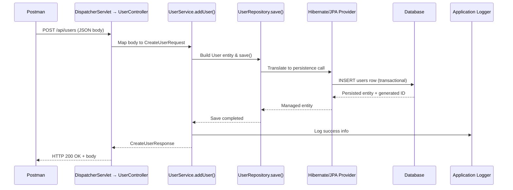

# User Create Request Flow

**설명**
- `UserController.addUser()`는 요청 본문을 `CreateUserRequest`로 역직렬화한 뒤 `UserService`를 호출합니다.
- `UserService`는 `User` 엔티티를 생성하고 `UserRepository.save()`를 통해 JPA(Hibernate)가 실제 DB `INSERT`를 수행하게 합니다.
- DB 반영이 성공하면 트랜잭션 커밋 후 애플리케이션 로거에 성공 로그가 남고, 컨트롤러는 200 OK 응답을 반환합니다.

